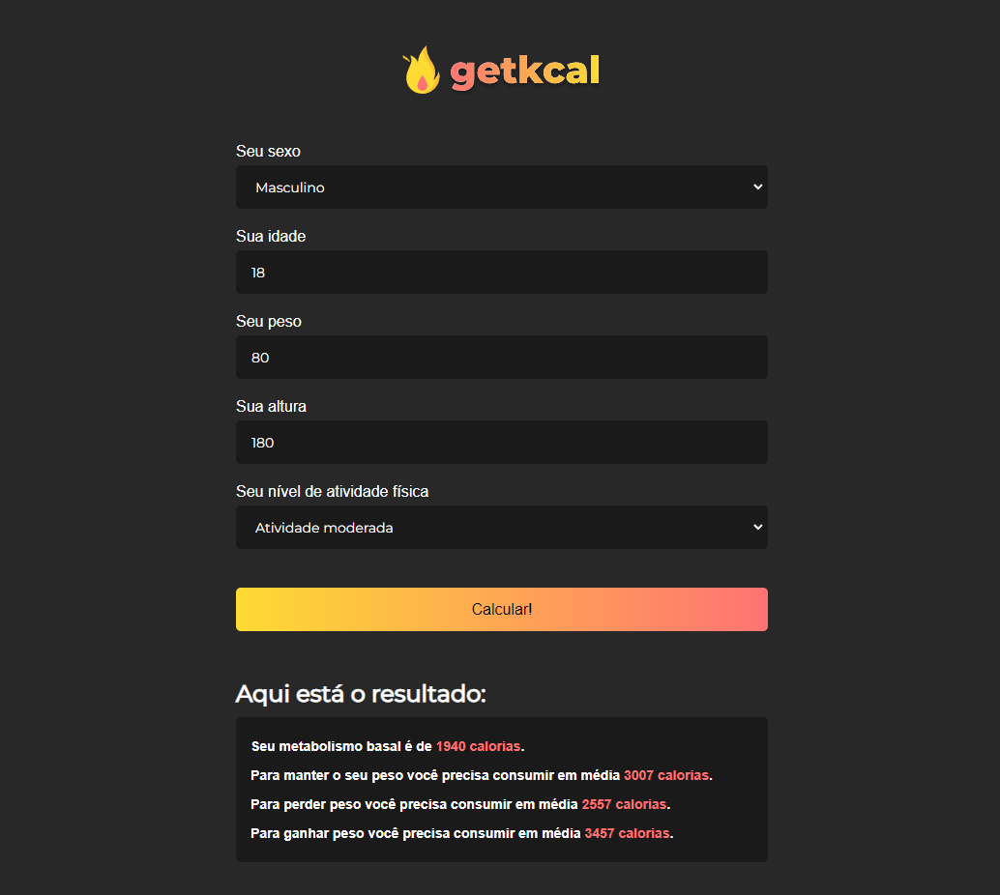

<h1 align="center">
  GetKcal
</h1>

  

  <a href="#-tecnologias">Tecnologias</a>&nbsp;&nbsp;&nbsp;|&nbsp;&nbsp;&nbsp;
  <a href="#-projeto">Projeto</a>&nbsp;&nbsp;&nbsp;|&nbsp;&nbsp;&nbsp;
  <a href="#memo-licença">Licença</a>

 

## 🚀 Tecnologias

Esse projeto foi desenvolvido com as seguintes tecnologias:

- HTML
- CSS
- JS

## 🚧 Projeto

Página de Cálculo calórico, feita com o objetivo de reforçar o aprendizado sobre formulários

Live Preview:

## 🎨 Inspiração:

Youtube : https://youtu.be/yiDq9wUiUjc

## 📚 Licença

Esse projeto está sob a licença MIT. Veja o arquivo [LICENSE](LICENSE) para mais detalhes.

---

Feito com ♥ by Gabriel Alves
